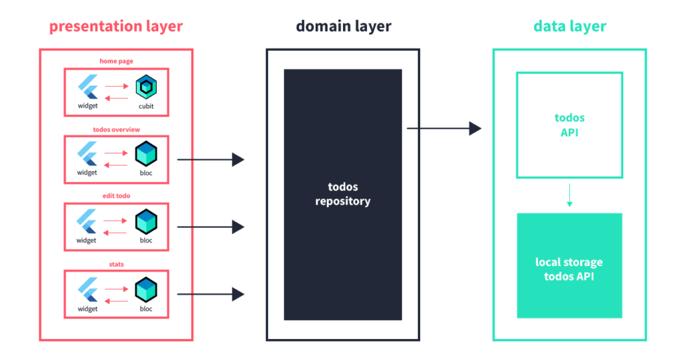

# Kalshi Finance Wellness Test

An simple finance wellness app, showcasing flutter engineering skills

---

## Preview

 

---

## App architecture

This app uses a simple architecture propoused by "Very Good Ventures" through their "very_good_cli" command line interface. It uses the Bloc Library and 3 layers to easily separate the responsibilities of every part of the code (see example image bellow).



- **Presentation layer:** The presentation layer is located at the `/lib` folder
- **Domain layer:** The domain layer is composed by `wellness_repository` subpackages located at `/packages` folder
- **Data layer:** The data layer would be composed by `client` or `api` for external data access. Data layer packages should be create as subpackages at `/packages` folder.


## Design system

This app is designed with a subpackage for its design system. The package `design_system` lives at the `packages` folder and it holds commom tokens and reusable widgets for the entire app.

Tokens: 
- Colors
- Assets (icons, logo, etc)
- Breakpoints
- Spacing
- Typography
- ...

Widgets:
- Reusable App Bar
- Reusable Base Page (with app bar)
- Reusable Button
- Reusable Text Input
- ...

Any new Token or Reusable widget should be added in the respective folder.


## Getting Started 🚀

This project contains 3 flavors:

- development
- staging
- production

To run the desired flavor either use the launch configuration in VSCode/Android Studio or use the following commands:

```sh
# Development
$ flutter run --flavor development --target lib/main_development.dart

# Staging
$ flutter run --flavor staging --target lib/main_staging.dart

# Production
$ flutter run --flavor production --target lib/main_production.dart
```

_\*The app works on iOS, Android, and Web._

---

